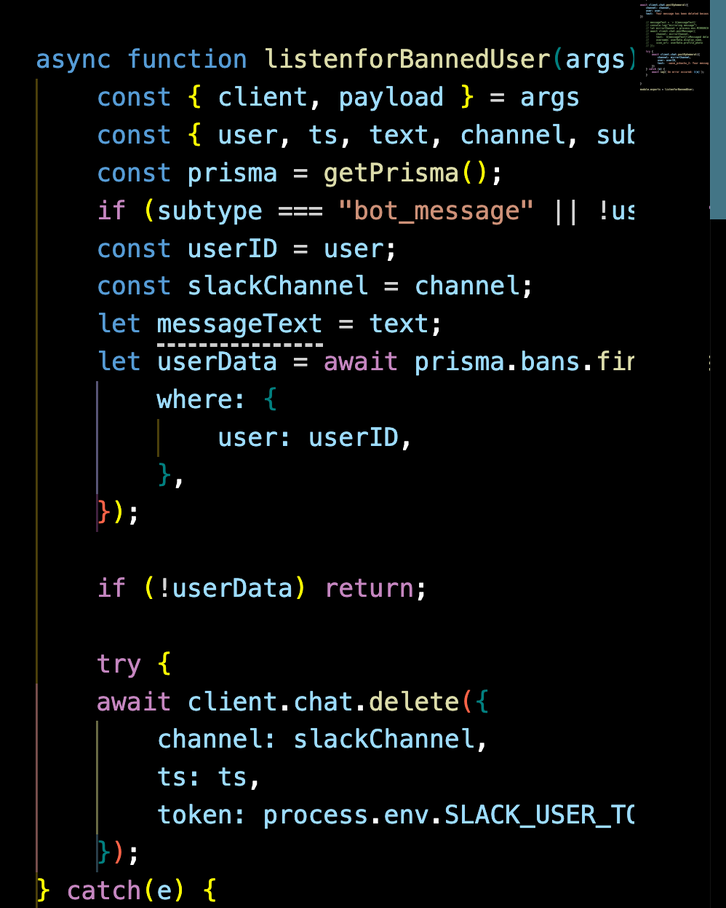

# FireHose
FireHose is a moderation helper bot that brings discord style moderation tools to the Slack to make moderating the Slack easier

You can test read-only mode [here](https://hackclub.slack.com/archives/C086NP2JC8N), send me a dm on Slack @radioblahaj if you want to try mute or channel ban!

It lets us:
- Mute people from the Slack
- Mute people from Channels only
- Make Channels read only & Whitelist people
- Start slow mode (WIP)

## Filesystem
- ```interactions``` is where the code for deleting messages, slow mode (WIP), muting people, and making channels read only; It also joins every new channel
 on creation (outside of interactions)
- ```commands``` is where the code to trigger read only mode, mutes, and channel bans live
- ```utils``` has helper functions to use Prisma, and things that haven't been shipped yet such as automatic ban timers


